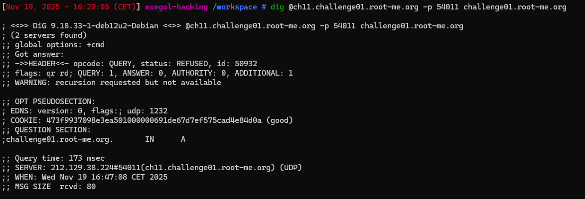

- Lance un dirb sur l'url on voit qu'il a y que un chemin possible qui est assets
- Ensuite dans Nginx, un alias est utilisé pour mapper un chemin URL à un chemin système spécifique:
```
location /images/ {
    alias /var/www/assets/images/;
}
```
- Donc une misconfiguration de l'alias fait qu'on peut modifier la requete GET pour obtenir un potentiel fichier ou dossier
