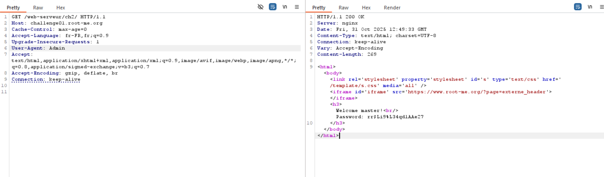

# 🧩Challenge : HTTP User-Agent

# 🔍 Description
- The main goal of this challenge is to access the admin page. To do this, we must modify the User-Agent header in the request.
- For that we use for intercept the request and edit the User-Agent header with admin 

# ⚙️ Exploitation
```bash
User-Agent: admin
```
- After we replace User-Agent with admin we have the password (flag)

